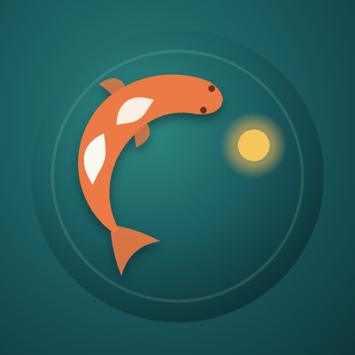
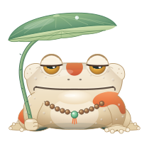
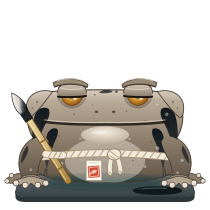

<p align="center">
  
</p>

<h1 align="center">Catching Days</h1>

<p align="center"><strong>A pond for your days.</strong></p>
<p align="center">Plan a little. Focus for a while. Watch something grow.</p>

<p align="center">
  <a href="#a-look-around">Take a look</a> ·
  <a href="#installation">Get started</a> ·
  <a href="#your-data">Your data</a>
</p>


Catching Days is a personal study and productivity app that brings your tasks, focus sessions, habits, projects, and journal into one small, living world. It is built for the ordinary work of making progress: choosing what matters today, starting the next problem, and noticing how the day actually went.

Finish a task and a fish swims into your pond. Focus toward your daily goal and a lotus opens. Return to your journal and the days become a garden of lily pads, moods, and memories. Along the bank, a cast of toad companions keeps you company.

Under the water is a practical toolkit: deadlines, subtasks, study priorities, exam readiness, focus history, and backups. The pond gives that work somewhere to live.

## What you can do

| Place | What happens there |
| --- | --- |
| **Today** | See today's tasks, choose work from your plan, watch completed tasks become fish, and grow your daily focus lotus. Overdue work stays visible in the reeds. |
| **Focus** | Bring tasks into a session, choose a focus and break rhythm, track cycles, bank earned rest, and rate or reflect on the work. Optional rain sets the atmosphere. |
| **Plan** | Organize assignments by class, add estimates and subtasks, track quizzes and exams, build recurring habits in Journeys, and keep projects moving. |
| **Journal** | Write entries with moods, tags, photos, and reusable prompts. Browse the calendar or connect recurring themes in the Vault. |
| **Sticky notes** | Give a passing thought a place to land. |
| **You** | Keep a structured bio, review your focus statistics and history, and explore the fish, bugs, and toad encyclopedia. |

Tasks have a **do-score** that weighs urgency, workload, importance, and time spent unstarted. It helps surface the next useful action. Your plan for today stays separate from the task's actual deadline.

## A look around

These are real app captures with fictional sample data. Click a screenshot to see it at full size.

<table>
  <tr>
    <td width="50%" valign="top">
      <a href="docs/images/focus.jpg"></a>
      <p><strong>A quieter place to focus.</strong><br>One session, a clear next task, and room for a break.</p>
    </td>
    <td width="50%" valign="top">
      <a href="docs/images/plan.jpg"></a>
      <p><strong>A plan you can work from.</strong><br>See what is pressing, how long it may take, and where it belongs.</p>
    </td>
  </tr>
  <tr>
    <td width="50%" valign="top">
      <a href="docs/images/journal.jpg"></a>
      <p><strong>Remember more than the checklist.</strong><br>Moods, entries, and study sessions share the same calendar.</p>
    </td>
    <td width="50%" valign="top">
      <a href="docs/images/vault.jpg"></a>
      <p><strong>Find the threads between days.</strong><br>Topics become lily pads; related entries gather around them.</p>
    </td>
  </tr>
  <tr>
    <td width="50%" valign="top">
      <a href="docs/images/collection.jpg"></a>
      <p><strong>Small wins leave something behind.</strong><br>Discover species through completed work and study milestones.</p>
    </td>
    <td width="50%" valign="top">
      <a href="docs/images/toads.jpg"></a>
      <p><strong>Good company by the water.</strong><br>Meet the keepers and companions who give the pond its character.</p>
    </td>
  </tr>
</table>

<details>
  <summary>See the complete Today screen</summary>


</details>

## Meet a few neighbors

The pond has nine toad personalities, each with a story of their own. Here are three of its keepers, pictured with the artwork used in the app.

<table>
  <tr>
    <td align="center" width="33%"><br><strong>Hasu</strong><br>Keeper of the Lotus<br><sub>Unhurried, observant, and ready with a dry remark.</sub></td>
    <td align="center" width="33%"><br><strong>Ame</strong><br>Keeper of the Rain<br><sub>Steady company for work that takes a while.</sub></td>
    <td align="center" width="33%"><br><strong>Sumi</strong><br>Keeper of the Ink<br><sub>A careful voice for putting a feeling into words.</sub></td>
  </tr>
</table>

## Installation

### What you need

- A modern web browser.
- **Python 3 or Node.js** for the local server. Choose whichever you already use; you only need one. Installers are available from [Python](https://www.python.org/downloads/) and [Node.js](https://nodejs.org/en/download).
- The complete app folder, including its scripts, styles, icons, and artwork.

The app uses plain HTML, CSS, and JavaScript. Running it locally does not require an account, a build step, or `npm install`.

### 1. Get the app

Download the project from [the repository](https://github.com/radhepa/Catching-Days) using **Code → Download ZIP**, then extract it. If you use Git:

```bash
git clone https://github.com/radhepa/Catching-Days.git catching-days
cd catching-days
```

### 2. Start the local server

**Windows:** double-click **Start Catching Days.bat** . The launcher finds Python or Node.js, starts the server, and opens the app. Keep the server window open while you use it.

**macOS, Linux, or a terminal on Windows:** open a terminal in the app folder and run one of these commands:

```bash
python3 server.py
```

```bash
node server.js
```

On Windows, you can also use `py -3 server.py` or `python server.py`.

### 3. Open your pond

Visit [http://127.0.0.1:8765/catching-days.html](http://127.0.0.1:8765/catching-days.html).

Use this address whenever you return. The local server handles saving; opening the HTML file directly from disk does not provide that save connection.

For your first day, add a class and a few tasks in **Plan**, choose what belongs on **Today**, and begin a **Focus** session. Set a realistic daily goal in **Settings**. A little progress is enough to start filling the pond.

### If something does not open

| Symptom | What to check |
| --- | --- |
| The launcher cannot find Python or Node.js | Install one runtime and reopen the launcher. Confirm that `py -3`, `python`, or `node` works in a terminal. |
| The page cannot connect | Keep the server running and check that the browser address uses the same port. |
| Port 8765 is already occupied | Run `python3 server.py 8766` or `node server.js 8766`, then open the same app path on port 8766. |
| Changes do not survive reopening | Open through the server and check **Settings → Permanent memory** for storage status. |
| Artwork or styles are missing | Extract the whole download and keep the supporting folders beside the HTML file. |

## Your data

With the local server, changes save automatically to **focus-data.json** in the app folder. On the first launch of a new day, the app also creates a safety snapshot in **focus-data.backup.json** when there is data to back up. The server listens only on your computer's loopback address, `127.0.0.1`.

Use **Settings → Permanent memory → Export JSON** for a separate, dated backup. Import that JSON through Settings when you need to restore or move your data. A browser-hosted copy stores its data in that browser on that device.

### Optional sync between devices

Cloud sync uses a private GitHub repository that you control. In **Settings → Cloud sync**, connect a repository and a fine-grained access token with **Contents: Read and write** permission for that repository. Create the private repository with a README first, so it has a branch to save to.

Then use the setup code from the connected device to connect your other device. Treat that code as a credential: it contains the access token. Sync merges records across devices, and commits in the data repository provide version history. Keep the private data repository separate from the app's source repository.


## For the curious builder

The interface runs in the browser, with a small Python or Node.js server for local persistence. Both servers use their language's standard libraries.

```text
catching-days.html      App shell and core study tools
server.py / server.js     Local file server and save endpoint
Start Catching Days.bat   Windows launcher
pond*.js                  Pond artwork, collection, and small stories
toad*.js                  Companion artwork, dialogue, and encyclopedia
projects.js / .css        Project workspace
sync-core.js / sync.js    Optional GitHub sync
manifest.webmanifest      App name, icons, and display metadata
icons/ / sprites/         App icons and supporting artwork
docs/images/              README screenshots and companion pictures
```

The historical `catching-days.html` filename is still the app's entry point; the name you see in the interface is **Catching Days**.

---

<p align="center"><em>One task caught. One lotus opened. A day worth keeping.</em></p>
