<p align="center">
  
</p>

<p align="center">
  <a href="#what-is-catching-days"><b>What it is</b></a> &nbsp;·&nbsp;
  <a href="#how-a-day-works"><b>How a day works</b></a> &nbsp;·&nbsp;
  <a href="#the-pond"><b>The pond</b></a> &nbsp;·&nbsp;
  <a href="#the-reed-bed"><b>The reed bed</b></a> &nbsp;·&nbsp;
  <a href="#the-toads"><b>The toads</b></a> &nbsp;·&nbsp;
  <a href="#installation"><b>Get started</b></a>
</p>

<p align="center">
  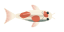&nbsp;
  &nbsp;
  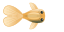&nbsp;
  &nbsp;
  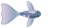&nbsp;
  &nbsp;
  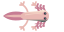&nbsp;
  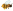&nbsp;
  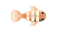
</p>

<p align="center">
  <i>Your tasks, focus sessions, habits and journal, all in one small living pond.<br>
  Do the work and the pond fills up with fish, insects and toads who keep you company.</i>
</p>

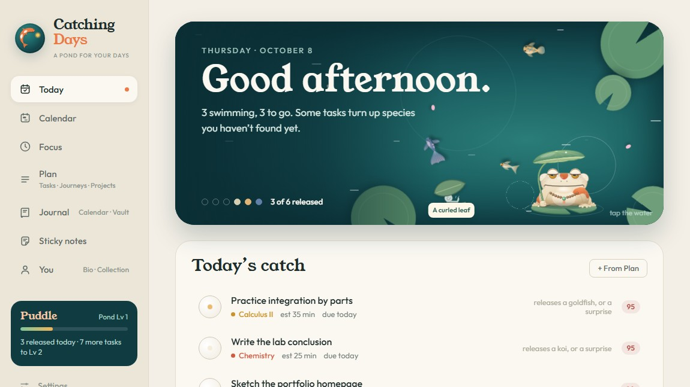

<p align="center"></p>

<h2 align="center">What is Catching Days?</h2>

Catching Days is a personal study and productivity app that lives in your browser. It does the ordinary things a planner should do: it keeps track of assignments and deadlines, runs focus sessions, builds habits, and holds a journal. Then it does one thing differently. **Everything you finish leaves something behind in a pond.**

Check off a task and a fish swims in. Reach your daily focus goal and a lotus opens. Come back to the journal and your days turn into a garden of lily pads. Along the bank sit nine toads, each with a job, a voice and a story, who comment on your day more kindly than any to-do list ever has.

It is meant for steady days, not heroic ones. There is no account to make and nothing to subscribe to. Your data stays on your computer, and the pond just quietly gets fuller.

<table>
  <tr>
    <td width="33%" valign="top" align="center"><br><b>A planner with a pulse</b><br><sub>Deadlines, estimates, a do-score that tells you what to do next, and a day planner that puts it on the clock.</sub></td>
    <td width="33%" valign="top" align="center"><br><br><b>Progress you can see</b><br><sub>385 fish, 100 insects and 9 toads to meet, all waiting on ordinary work.</sub></td>
    <td width="33%" valign="top" align="center"><br><b>A journal that listens</b><br><sub>Moods, photos, tags, a calendar of lily pads and a Vault that connects themes.</sub></td>
  </tr>
</table>

<p align="center"></p>

<h2 align="center">How a day works</h2>

<p align="center">
  
</p>

1. **Plan.** Add your classes and tasks in **Plan**. Give each one a deadline, an estimate, maybe a few subtasks. Recurring habits live in **Journeys**, and bigger efforts in **Projects**.
2. **Choose.** On **Today**, pick what actually belongs in today. The plan for today stays separate from a task's real deadline, so choosing a lighter day never hides something that is due. Then give it a time: drag tasks onto **Your day**, around your classes and other commitments, or let **Plan my day** fit them in for you.
3. **Focus.** Start a **Focus** session with one or more tasks. Choose a focus and break rhythm, count cycles, bank the rest you have earned, and let the rain fall if you like. Time spent counts toward your daily goal and opens the day's lotus.
4. **Release.** Finish a task and a fish is released into your pond, sometimes a species you have not met yet. Tasks hint at what they will release ("a goldfish, or a surprise"), and the fish is decided by the task itself, so unticking and re-ticking never rerolls it.
5. **Reflect.** End the day in the **Journal**: a mood, a few lines, a photo. The calendar fills with flowering lily pads, and the Vault threads related entries together.

A few small mechanics keep the day honest:

| | |
| --- | --- |
| **Do-score** | Every task gets a score from 0 to 100 that weighs urgency, workload, importance and how long it has sat unstarted. It is only a nudge toward the next useful action; you always decide. |
| **Pond levels** | Released tasks grow the pond through ten stages: Puddle, Spring, Brook, Still Water, Lily Pond, Koi Garden, Deep Pond, Moon Lake, Great Lake, Open Sea. |
| **Daily lotus** | Focus minutes toward your daily goal open the lotus on Today. Reach the goal and it is in full bloom. |
| **Lotus path** | Each day the lotus fully blooms, a lily pad floats onto the water. Pads on days in a row make a path, and the longer it grows the more of the pond comes to it: a frog at 3 days, a dragonfly at 7, lotus flowers at 14, fireflies at 21, a turtle at 30, the moon at 50 and the old pond at 100. Miss a day and the path breaks; the next bloom starts a new one, and today never breaks it until midnight. |
| **Overdue work** | It never disappears. Overdue tasks wait in the reeds where you can see them. |
| **Your day** | Today and the Calendar lay your day out hour by hour: your calendar's commitments, plus blocks of time you set aside for tasks. A task without an estimate gets a guess (marked `~`) from similar tasks and the kind of work it is. |
| **Tests coming up** | Quizzes and exams in the next two weeks sit under Today's list as reminders (Settings changes how far ahead). On the day, tick one off: you're asked how it went from 1 to 5, and one of the toads answers. |

<p align="center"></p>

<h2 align="center">Where everything lives</h2>

| Place | What happens there |
| --- | --- |
| **Today** | See today's tasks, give them a time on **Your day**, watch completed tasks become fish, keep an eye on tests coming up, and grow your daily focus lotus. The bug of the day visits the reeds here. |
| **Calendar** | Plan a day, three days or a week: drag tasks and exam study onto the timeline around your classes, let **Plan my day** fill the gaps, and connect Google Calendar (or any `.ics` calendar). |
| **Focus** | Bring tasks into a session, choose a focus and break rhythm, track cycles, bank earned rest, and rate or reflect on the work. Optional rain sets the atmosphere. |
| **Plan** | Organize assignments by class, add estimates and subtasks, track quizzes and exams, build recurring habits in Journeys, and keep projects moving. |
| **Journal** | Write entries with moods, tags, photos, and reusable prompts. Browse the calendar or connect recurring themes in the Vault. |
| **Sticky notes** | Give a passing thought a place to land. |
| **You** | Keep a structured bio, review your focus statistics and history, and explore the encyclopedia of fish, bugs and toads. |

<p align="center"></p>

<h2 align="center">Your day, on the clock</h2>

<p align="center"><i>A list says what to do. A day says when.</i></p>

<p align="center">
  <a href="docs/images/calendar.jpg">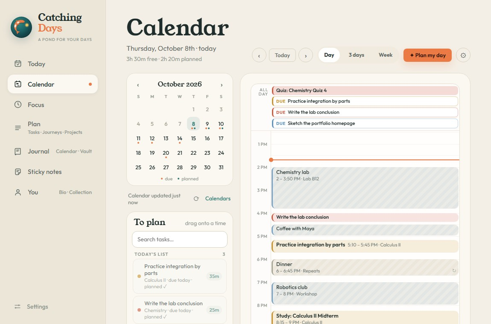</a>
</p>

**Your day** sits at the top of Today, and the **Calendar** tab gives it a whole page with day, three-day and week views. Your commitments are already there, and the rest of the day is yours to arrange.

- **Drag a task onto a time.** Pull it from the tray, from Today's list or from the "not on the clock yet" chips. Drag a block to move it, stretch its bottom edge to change its length, or drop it back on the tray to unplan it. On a phone, tap a task and then tap a time.
- **Plan my day.** It fills your free time around your commitments, most urgent first, as a suggestion you keep or throw away. Nothing is planned after its due date, a habit only lands on its own day, and exam prep goes in ahead of the exam.
- **Estimates when you have none.** A task without one gets a guess from similar tasks in the same class, that class's usual, or the kind of work its title describes. It's marked `~` until you change it.
- **Slipped blocks get a second chance.** A block that passes unfinished is marked, and one click finds it a new time.
- **Things that repeat.** Block off time you're always busy (gym, work, dinner) and make it weekly, or keep a habit at the same time every day.
- **A nudge when it's time.** When a planned block starts you get a reminder, with **Focus** one tap away.
- **Your calendar, read-only.** Connect Google Calendar through its private iCal address (see [Connecting a calendar](#connecting-a-calendar)), or any other `.ics` calendar: Outlook, Apple, or a school's course calendar. Classes that repeat, moved or cancelled meetings, and time zones all come through. Nothing is ever changed in your calendar.

<p align="center"></p>

<h2 align="center">
  &nbsp;
  The pond
  &nbsp;
</h2>

<p align="center"><i>385 species, from backyard koi to whale sharks. Every one has a name, a rarity and a little lore.</i></p>

<p align="center">
  
</p>

Each class you add adopts a species of its own. When you finish one of its tasks there is a **30% chance** you get that class's fish; otherwise the pond rolls any species, weighted by rarity (roughly 60% common, 27% uncommon, 10% rare and 3% legendary). A handful of species never come from rolls at all and are given as milestone rewards. There are **118 common, 127 uncommon, 108 rare and 32 legendary** species in all, and the welcome screen keeps count of how many you have found. The fish above are the same artwork the app draws, tails wagging and all.

<table>
  <tr>
    <td width="50%" valign="top">
      <a href="docs/images/collection.jpg">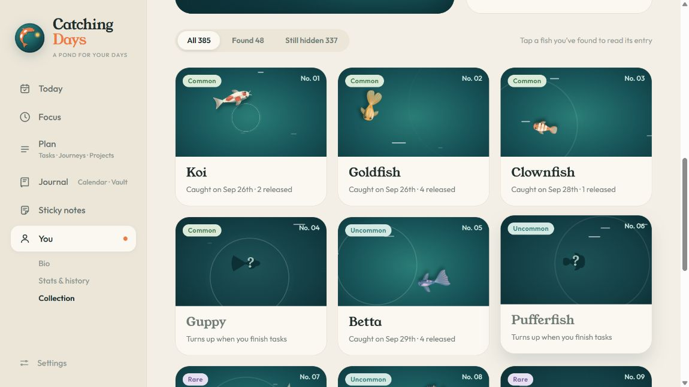</a>
      <p align="center"><sub><b>The collection.</b> Discovered species fill in; the rest wait in the dark.</sub></p>
    </td>
    <td width="50%" valign="top">
      <a href="docs/images/today.jpg">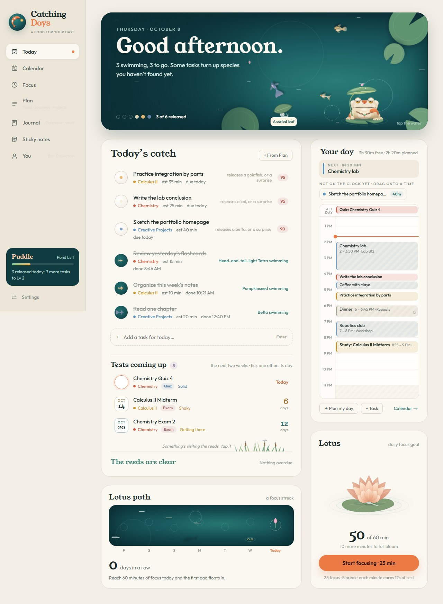</a>
      <p align="center"><sub><b>Today.</b> Tasks to catch, tests coming up, your day on the clock, and a lotus to open.</sub></p>
    </td>
  </tr>
</table>

<p align="center"></p>

<h2 align="center">
  &nbsp;
  The reed bed
  &nbsp;
</h2>

<p align="center"><i>One insect visits the reeds on Today each day, and it behaves the way the real one does.</i></p>

<p align="center">
  
</p>

There are **100 different bugs**, shuffled so that each gets its turn before any repeats and no bug visits two days in a row. They are not decorations on a loop. Each has its own flight plan, worked out from where the reeds and cattails actually stand:

| | Who | What it does |
| --- | --- | --- |
|  | **Dragonfly** | Patrols from cattail tip to cattail tip, darting out and coming back to the same few perches. |
|  | **Honeybee** | Lands on the pollen spike above the brown head, works down it, then bumbles to the next. |
|  | **Ladybug** | Climbs a blade all the way to the tip before it will take off, because that is what ladybugs do. |
|  | **Firefly** | Weaves low and slow among the leaves, flashes as it swoops up in a J, then settles and glows. |
|  | **Mayfly** | Dances up and parachutes down. As an adult it lives about a day, and the app says so. |
|  | **Ebony jewelwing** | Perches and flicks its black wings open and shut. |

Tap the day's bug on Today to **catch it**. It joins your bug collection, and a small card gives you a field note about the real animal: why a mayfly lives only a day, what a lacewing larva eats, how a hoverfly hangs in the air. Bugs you have not met yet sit in the collection as `???` until their day comes around, and a few are legends.

<p align="center"></p>

<h2 align="center">
  &nbsp;
  The toads
  &nbsp;
</h2>

<p align="center"><i>Nine neighbours, each with a home in the app, a temperament and a very particular way of saying "keep going".</i></p>

Five keepers watch over the main rooms of the app. Four companions live at the edges of the pond. Each has an encyclopedia entry with a short story, and in the app they move when you hover over them (the motion respects your system's reduced-motion setting).

They also have your back on test day. Tick off a quiz or exam under Today's list and you're asked how it went, from 1 (rough) to 5 (great). Then one of the nine answers in its own voice, sitting in the pond: comfort after a rough one, a celebration after a great one. The lily pad beside it even grows a flower to match.

<p align="center">
  <a href="docs/images/exam-checkoff.jpg">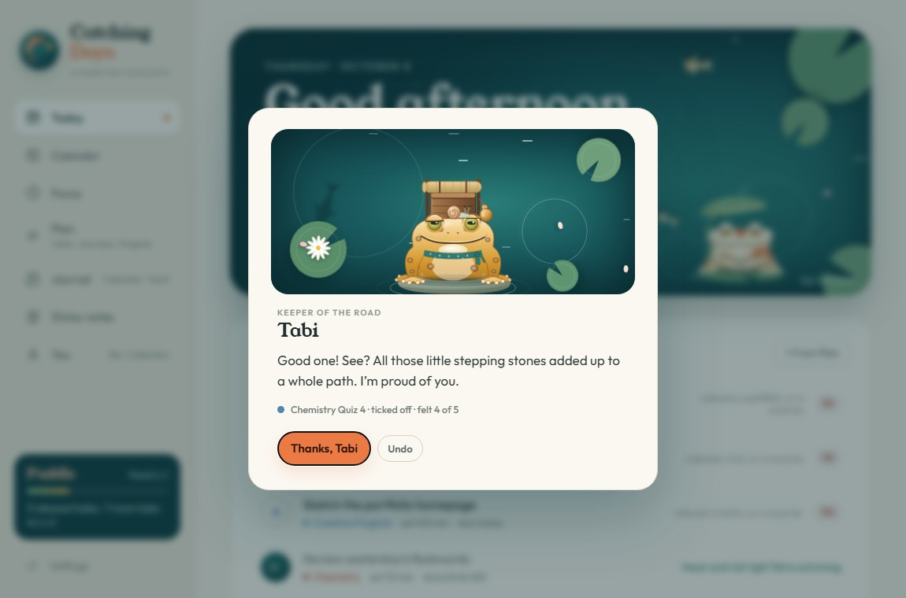</a>
</p>

<table>
  <tr>
    <td width="33%" valign="top" align="center"><br><b>Hasu</b><br><sub>Keeper of the Lotus · <i>Today</i></sub><br><sub>Unhurried, observant, dry wit</sub><br><sub>“I’ve sat on this pad for two hundred summers. You can sit for twenty-five minutes.”</sub></td>
    <td width="33%" valign="top" align="center"><br><b>Ame</b><br><sub>Keeper of the Rain · <i>Focus</i></sub><br><sub>Steady, practical, few words</sub><br><sub>“Rain doesn’t hurry. Still gets everything wet.”</sub></td>
    <td width="33%" valign="top" align="center"><br><b>Sumi</b><br><sub>Keeper of the Ink · <i>Journal</i></sub><br><sub>Exact, gentle, a little formal</sub><br><sub>“Naming a feeling makes it smaller. Not gone. Smaller.”</sub></td>
  </tr>
  <tr>
    <td width="33%" valign="top" align="center"><br><b>Tabi</b><br><sub>Keeper of the Road · <i>Journeys</i></sub><br><sub>Generous, talkative, optimistic</sub><br><sub>“Road rule: the first step is the cheap one. Take it while it’s on sale.”</sub></td>
    <td width="33%" valign="top" align="center"><br><b>Hotaru</b><br><sub>Keeper of the Lanterns · <i>Collection</i></sub><br><sub>Sleepy, soft-spoken, unexpected insight</sub><br><sub>“…Mm. Every light in here was a task you finished. Did you know that?”</sub></td>
    <td width="33%" valign="top" align="center"><br><b>Neri</b><br><sub>Keeper of the Kiln · <i>Pondside pottery</i></sub><br><sub>Affectionate, opinionated, forgiving</sub><br><sub>“Perfectly round? Then how would I know which one was mine?”</sub></td>
  </tr>
  <tr>
    <td width="33%" valign="top" align="center"><br><b>Oto</b><br><sub>Keeper of the Reeds · <i>Music by the water</i></sub><br><sub>Curious, bashful, persistent</sub><br><sub>“The squeak was intentional. The second squeak was a surprise.”</sub></td>
    <td width="33%" valign="top" align="center"><br><b>Kuri</b><br><sub>Keeper of the Roots · <i>The root bed</i></sub><br><sub>Patient, grounded, quietly tender</sub><br><sub>“Leave it be. Roots do their best work without an audience.”</sub></td>
    <td width="33%" valign="top" align="center"><br><b>Mame</b><br><sub>A Small Child of the Pond · <i>Leaf-boat adventures</i></sub><br><sub>Inquisitive, earnest, playful</sub><br><sub>“If the boat sinks, I’ll call it a submarine.”</sub></td>
  </tr>
</table>

<p align="center"></p>

<h2 align="center">A look around</h2>

<p align="center"><sub>Real captures with fictional sample data. Click one to see it full size.</sub></p>

<table>
  <tr>
    <td width="50%" valign="top">
      <a href="docs/images/focus.jpg">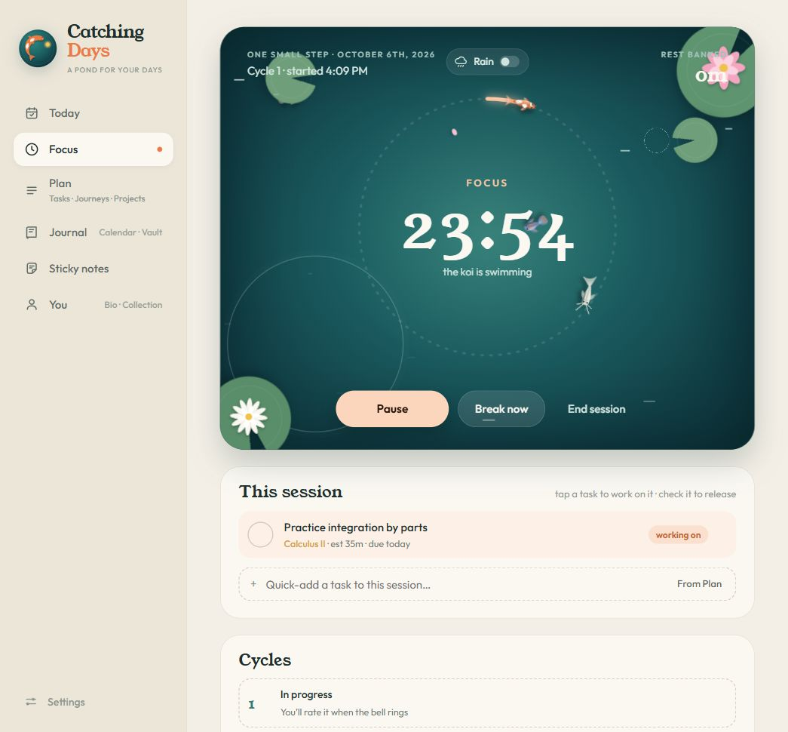</a>
      <p><strong>A quieter place to focus.</strong><br>One session, a clear next task, and room for a break.</p>
    </td>
    <td width="50%" valign="top">
      <a href="docs/images/plan.jpg">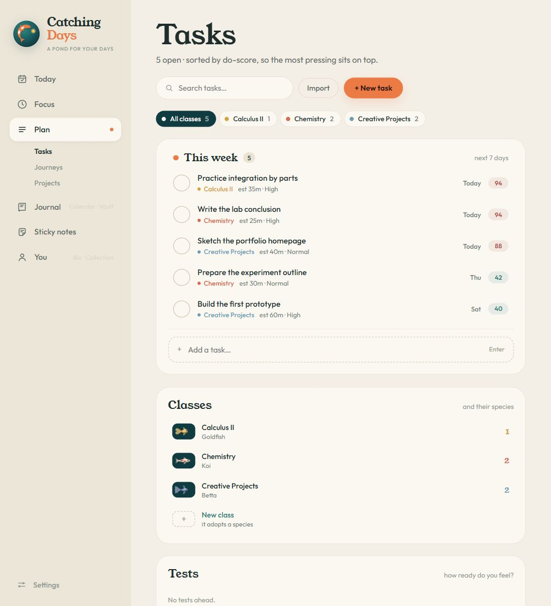</a>
      <p><strong>A plan you can work from.</strong><br>See what is pressing, how long it may take, and where it belongs.</p>
    </td>
  </tr>
  <tr>
    <td width="50%" valign="top">
      <a href="docs/images/journal.jpg">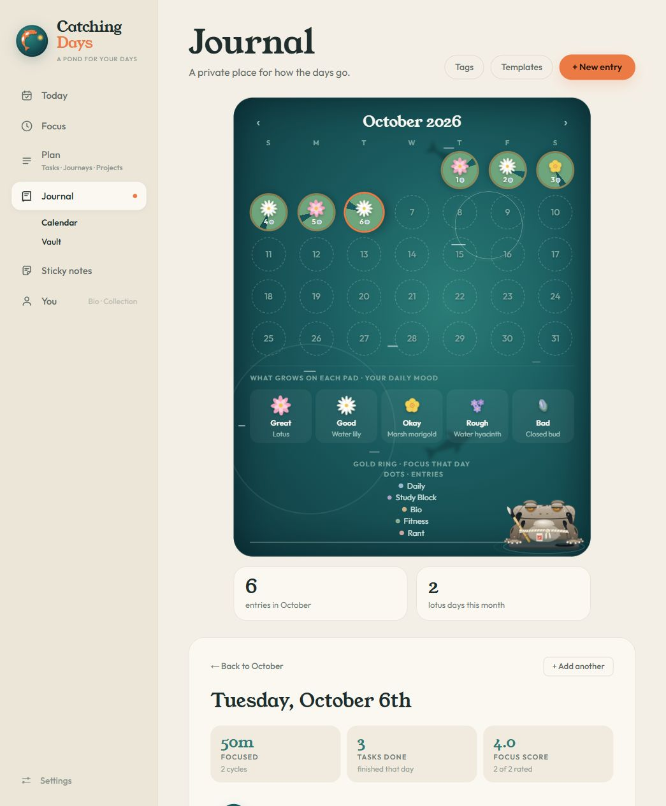</a>
      <p><strong>Remember more than the checklist.</strong><br>Moods, entries, and study sessions share the same calendar.</p>
    </td>
    <td width="50%" valign="top">
      <a href="docs/images/vault.jpg">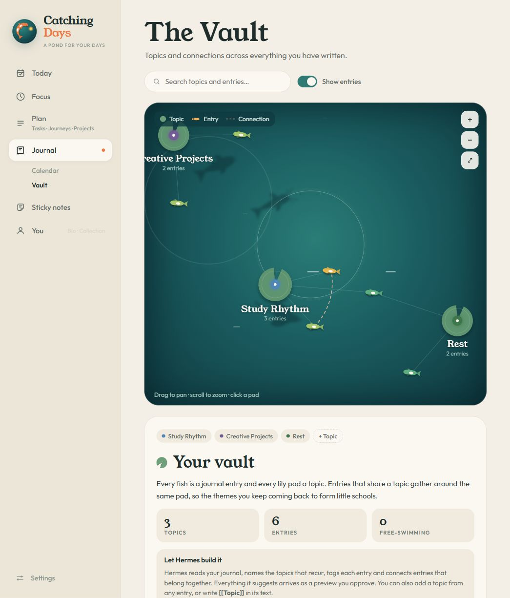</a>
      <p><strong>Find the threads between days.</strong><br>Topics become lily pads; related entries gather around them.</p>
    </td>
  </tr>
  <tr>
    <td width="50%" valign="top">
      <a href="docs/images/toads.jpg">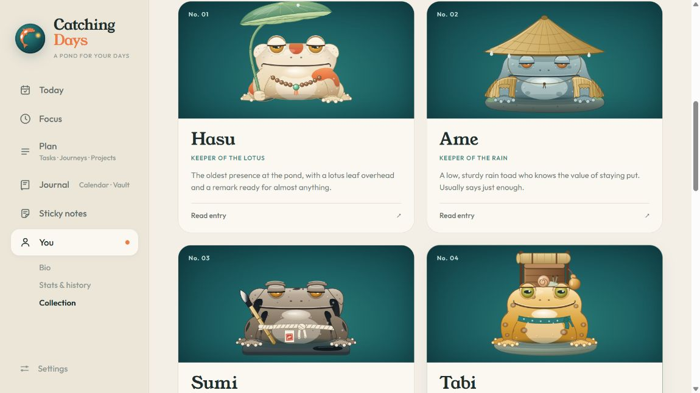</a>
      <p><strong>Good company by the water.</strong><br>The toad encyclopedia, with a personality card for every neighbour.</p>
    </td>
    <td width="50%" valign="top">
      <a href="docs/images/welcome.jpg">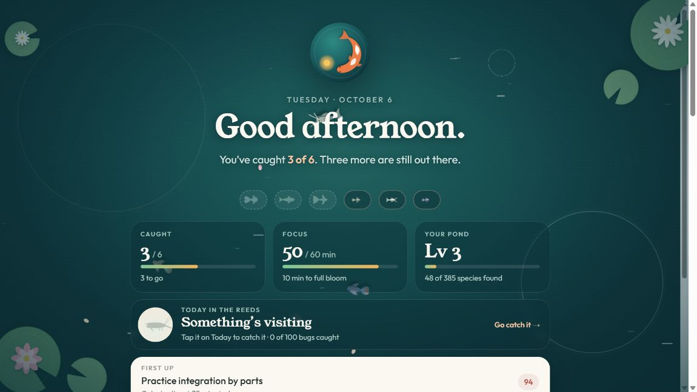</a>
      <p><strong>A gentle hello.</strong><br>Each day opens with what you have caught, how long you have focused, and who is visiting the reeds.</p>
    </td>
  </tr>
</table>

<p align="center"></p>

## Installation

### What you need

- A modern web browser.
- **Python 3 or Node.js** for the local server. Choose whichever you already use; you only need one. Installers are available from [Python](https://www.python.org/downloads/) and [Node.js](https://nodejs.org/en/download).
- The complete app folder, including its scripts, styles, icons, and artwork.

The app uses plain HTML, CSS, and JavaScript. Running it locally does not require an account, a build step, or `npm install`.

### 1. Get the app

Download the project from [the repository](https://github.com/radhepa/Catching-Days) using **Code → Download ZIP**, then extract it. If you use Git:

```bash
git clone https://github.com/radhepa/Catching-Days.git catching-days
cd catching-days
```

### 2. Start the local server

**Windows:** double-click **Start Catching Days.bat** . The launcher finds Python or Node.js, starts the server, and opens the app. Keep the server window open while you use it.

**macOS, Linux, or a terminal on Windows:** open a terminal in the app folder and run one of these commands:

```bash
python3 server.py
```

```bash
node server.js
```

On Windows, you can also use `py -3 server.py` or `python server.py`.

### 3. Open your pond

Visit [http://127.0.0.1:8765/catching-days.html](http://127.0.0.1:8765/catching-days.html).

Use this address whenever you return. The local server handles saving; opening the HTML file directly from disk does not provide that save connection.

For your first day, add a class and a few tasks in **Plan**, choose what belongs on **Today**, and begin a **Focus** session. Set a realistic daily goal in **Settings**. A little progress is enough to start filling the pond.

### If something does not open

| Symptom | What to check |
| --- | --- |
| The launcher cannot find Python or Node.js | Install one runtime and reopen the launcher. Confirm that `py -3`, `python`, or `node` works in a terminal. |
| The page cannot connect | Keep the server running and check that the browser address uses the same port. |
| Port 8765 is already occupied | Run `python3 server.py 8766` or `node server.js 8766`, then open the same app path on port 8766. |
| Changes do not survive reopening | Open through the server and check **Settings → Permanent memory** for storage status. |
| Artwork or styles are missing | Extract the whole download and keep the supporting folders beside the HTML file. |
| The Calendar says to restart Catching Days | The server window was started before calendars could be read. Close it and start the app again. |

## A toad on your desktop (optional)

The **desktop-pet** folder is an add-on: one of the nine toads sits on your Windows desktop, on top of your other windows. Tap it to tick off today's tasks, look at your day, or start a focus session: the toad comes to the middle of the screen, asks if you're ready, counts down 3, 2, 1, and slithers into a corner with your timer under it. No need to open the app. Drag it around, or push it against the edge of the screen and it hides with only its head peeking out.

<a href="docs/images/desktop-toad.jpg">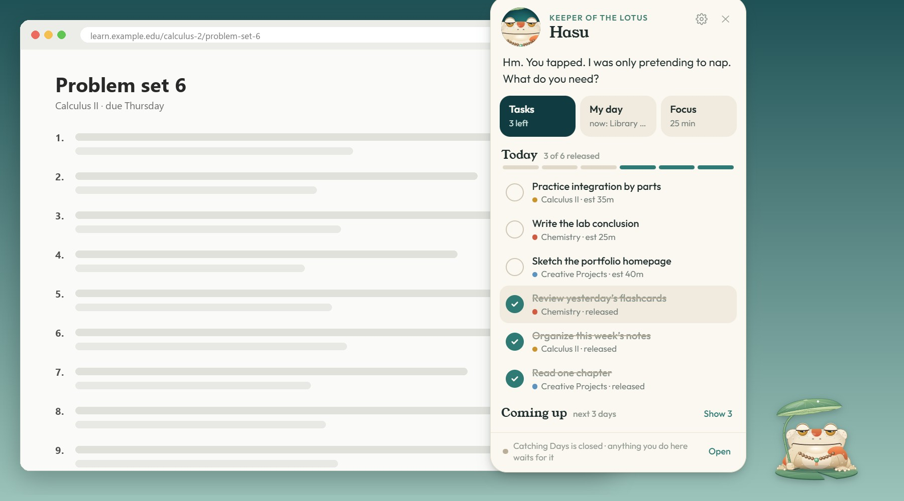</a>

It needs Node.js. Double-click **desktop-pet/Install Desktop Toad.bat**, or see [desktop-pet/README.md](desktop-pet/README.md). The toad never writes your save file; what you do on it is handed to the app, which applies it the moment it's open.

## Your data

With the local server, changes save automatically to **focus-data.json** in the app folder. On the first launch of a new day, the app also creates a safety snapshot in **focus-data.backup.json** when there is data to back up. The server listens only on your computer's loopback address, `127.0.0.1`.

Use **Settings → Permanent memory → Export JSON** for a separate, dated backup. Import that JSON through Settings when you need to restore or move your data. A browser-hosted copy stores its data in that browser on that device.

### Connecting a calendar

In **Calendar → Connect Google Calendar**, paste your calendar's **Secret address in iCal format** (Google Calendar → Settings → your calendar → Integrate calendar). The local server reads that address for you, because a web page isn't allowed to read another site directly; it only fetches `https://` calendar files. The address and a copy of the next few weeks of events are kept in your data, so a synced phone shows them too. Treat the secret address like a password: anyone who has it can see that calendar. Remove it in the Calendar's settings at any time.

### Optional sync between devices

Cloud sync uses a private GitHub repository that you control. In **Settings → Cloud sync**, connect a repository and a fine-grained access token with **Contents: Read and write** permission for that repository. Create the private repository with a README first, so it has a branch to save to.

Then use the setup code from the connected device to connect your other device. Treat that code as a credential: it contains the access token. Sync merges records across devices, and commits in the data repository provide version history. Keep the private data repository separate from the app's source repository.


## For the curious builder

The interface runs in the browser, with a small Python or Node.js server for local persistence. Both servers use their language's standard libraries.

```text
catching-days.html      App shell and core study tools
server.py / server.js     Local file server and save endpoint
Start Catching Days.bat   Windows launcher
pond*.js                  Pond artwork, collection, and small stories
toad*.js                  Companion artwork, dialogue, and encyclopedia
projects.js / .css        Project workspace
planner*.js / .css        Day planner, Calendar tab and calendar-feed reader
exam-checkoff.js / .css   Ticking off a quiz or exam, and a toad's answer
sync-core.js / sync.js    Optional GitHub sync
desktop-pet/              Optional desktop toad (Electron); desktop-pet-link.js is its way in
manifest.webmanifest      App name, icons, and display metadata
icons/ / sprites/         App icons and supporting artwork
docs/images/              README art: pond banner, fish, bugs, toads, screenshots
```

The historical `catching-days.html` filename is still the app's entry point; the name you see in the interface is **Catching Days**.

---

<p align="center"><em>One task caught. One lotus opened. A day worth keeping.</em></p>

<p align="center"></p>

<p align="center">
  &nbsp;
  &nbsp;
  &nbsp;
  &nbsp;
  
</p>

<p align="center"><i>Plan a little. Focus for a while. Watch something grow.</i></p>
