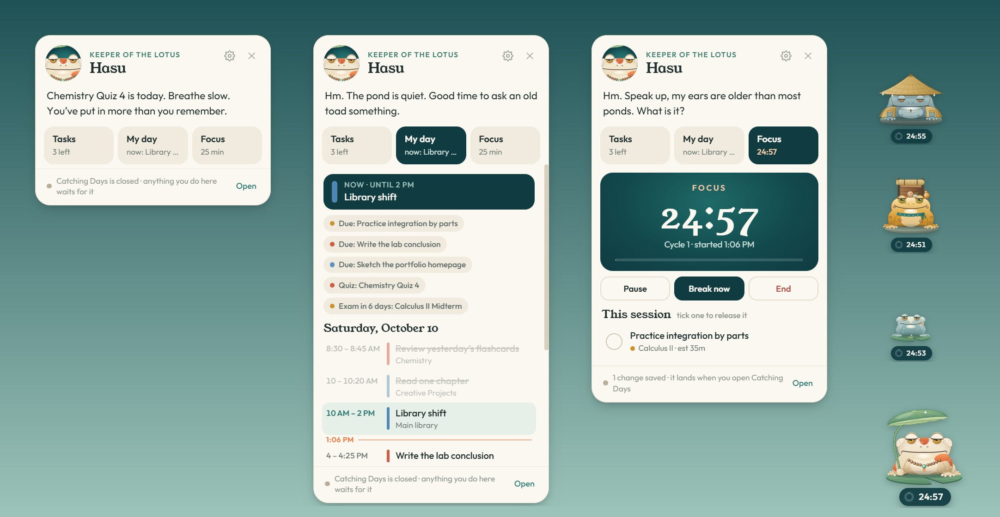

# Desktop toad

An optional add-on for Catching Days: one of the pond's nine toads lives on your desktop, on top of your other windows, so you never have to open the app to tick something off.


- **Drag it anywhere.** It stays where you leave it.
- **Push it against the left, right or bottom edge of the screen** and it hides there with only its head peeking out (at the bottom it sinks until just its eyes are above the line, like a toad in a pond). Drag it back out to see all of it.
- **Tap it** and it says something, then gives you three places:
  - **Tasks**: today's list, what's waiting in the reeds, and what's coming up. Tick one and it's released into the pond.
  - **My day**: your Calendar tab's timeline for today, what's on now and what's next, plus deadlines and tests coming up.
  - **Focus**: the toad comes out to the middle of your screen and asks, in its own way, whether you're ready and mean it (pick Gentle, Classic, Deep or your usual rhythm right there). Say yes and it answers, counts down 3, 2, 1, starts the session, and slithers off into a bottom corner with the timer under it. Say not yet and it goes back where it was. It rings the bell when the block is done, and you can rate the block, take your break, and save the session without leaving what you're doing. "Pick tasks first" opens a set-up where you can bring tasks into the session.
- **Choose your toad**: Hasu, Ame, Sumi, Tabi, Hotaru, Neri, Oto, Kuri or Mame. Each one talks in its own voice. Right-click the toad (or use the tray icon) for the chooser, the size, and Start with Windows.



<sub>Captures use fictional sample data.</sub>

## Install (Windows)

You need [Node.js](https://nodejs.org) and Catching Days running from its local server (`Start Catching Days.bat`).

1. Keep this `desktop-pet` folder inside your Catching Days folder.
2. Double-click **Install Desktop Toad.bat**. It downloads Electron (about 100 MB, once), adds a **Catching Days Toad** shortcut to your Start menu, starts the toad, and sets it to start with Windows. You can turn that off from the toad's settings.

Or by hand, in a terminal in this folder:

```bash
npm install
npm start
```

If the toad can't find Catching Days next to it, it asks you to pick the folder that has `focus-data.json` in it.

## How it works with your data

The toad never writes your save file. It reads `focus-data.json`, and puts what you do on it (a tick, a session started, a block rated) into `desktop-pet-inbox.json` next to it. The app, through `desktop-pet-link.js`, takes each one in with its own functions, so a task ticked on the desktop releases its fish and a session started there is saved with its cycles, exactly as if you'd done it in the app. Each action is stamped with the moment you did it.

- **App open:** it lands at once, even if the app's tab is in the background. If the session would need one of the app's dialogs while you have another dialog open, it waits for you to close yours.
- **App closed:** it waits in the inbox, the toad shows it as done in the meantime, and it lands the next time you open the app.

The toad also listens on `127.0.0.1` (a port from 8771 up) so the open app can hear about each action right away. Nothing is reachable from outside your computer.

## Files

```text
main.js          the toad's windows, dragging and edge peeking, the inbox, the bell
core.js          reads the pond: today's list, the reeds, the do-score, the day, the session clock
pet.js / .css    the toad on the desktop (art loaded from the app's own toad files)
panel.js / .css  the talk box: chat, tasks, the day, focus
stage.js / .css  the focus ritual: the toad in the middle of the screen, 3, 2, 1, off to a corner
pet-lines.js     what each of the nine toads says
preload.js       the bridge between the windows and the rest
test/            node tests for core.js
```

`desktop-pet-link.js` lives in the app folder, beside `catching-days.html`, which loads it. Without the toad it does nothing.
